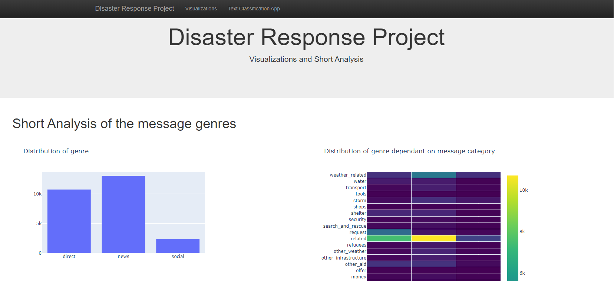
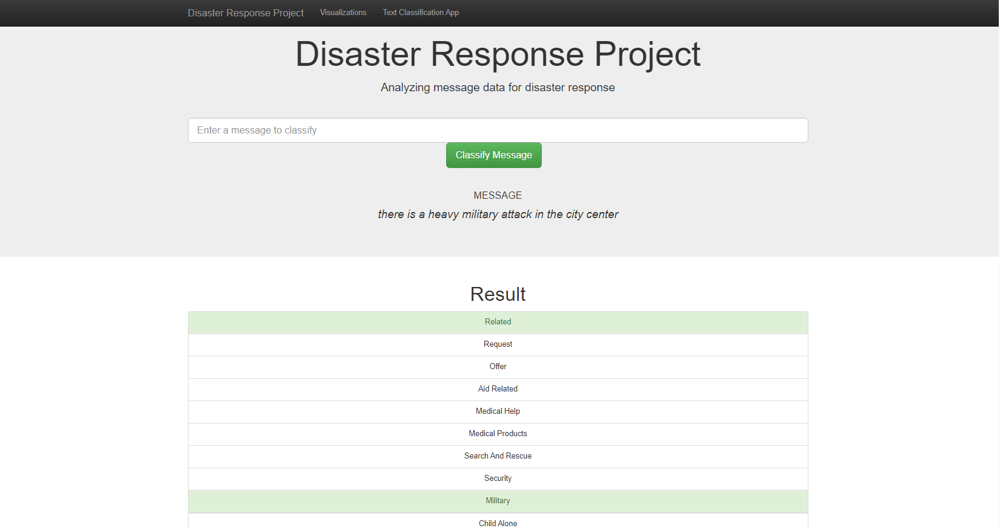

# Project Disaster Response Pipeline
This project is part of the Data Scientist Nanodegree Program.

### Table of Contents
1. [Project Motivation](#motivation)
2. [File Description](#files)
3. [Installation / Setup](#installation)
4. [Impressions of the web app](#screenshots)
5. [Licensing, Authors](#licensing)

## Project Motivation 

The present project is a part of the Nano-degree program of Udacity. 
Within this project, the goal is to develop a complete Web App based on Flask capable of visualizing interactive analysis of the underlying data and a machine learning classifier capable of predicting user input instantly.

The underlying data is about the messages sent out within a disaster situation (e.g. a hurricane).
The messages themselves are very precious to disaster responsibles (e.g. a responsible for water supply or fire fighter etc.) to efficiently organize help for the potential victims and people affected by the event. But the amount of messages and the unstructured nature of the data makes it difficult for the repsonsibles to grasp efficiently the most important for their area of responsibily. 

This is why we (as mentioned above), the task is to build a classifier classifying the messages into different categories to make it easier to filter the most important content for the responsibles. 

Concretly we:
* setup an ETL Pipeline (Extract, tranform, load) incl. cleaning the data with NLP techniques + storing it into a SQLite db.
* building a Machine Learning Pipeline incl. Gridsearch and model evaluation training a suitable classifier
* creating a Flask Web App visualizing a short Analysis of the cleaned input data incl. flexible file path input possibility + a possibility to type in messages which will be classified directly in the browser.

Beside these concrete project requirements concerning the data processing, version control is leveraged to keep track of the progress of the project steps.

## File Description 
**app/prepare_figures.py**: helper function to prepare the plotly figures presented on the webapp 
**app/run.py**: python script to launch the web app 
**data/**: Data relevant for the given usecase and a script to preprocess the data.  
**models/**: Script to train the mentioned model within the pipeline and store it in a pkl file. The pkl file is not stored within github due to size constraints. 

## Installation / Setup 
1. Setup the virtual environment in the environment folder via pipenv   
2. Run within the `data/`- folder the following command to clean the data & store the results in a respective database:
`python process_data.py disaster_messages.csv disaster_categories.csv DisasterResponse.db`
3. Run within the `models/`- folder the following commnad to train the model with the cleaned data, choose the best hyperparameters via Grid-Search and store the model in a pkl-file for further use: `python train_classifier.py ../data/DisasterResponse.db classifier.pkl`
4. Run the following command within the `app/`- folder to run the web app: `python run.py`
5. Go in your browser to the following adress: http://127.0.0.1:3001

## Impressions of the web app 

## Licensing, Authors 
The credit for the data goes to the company figure eight.