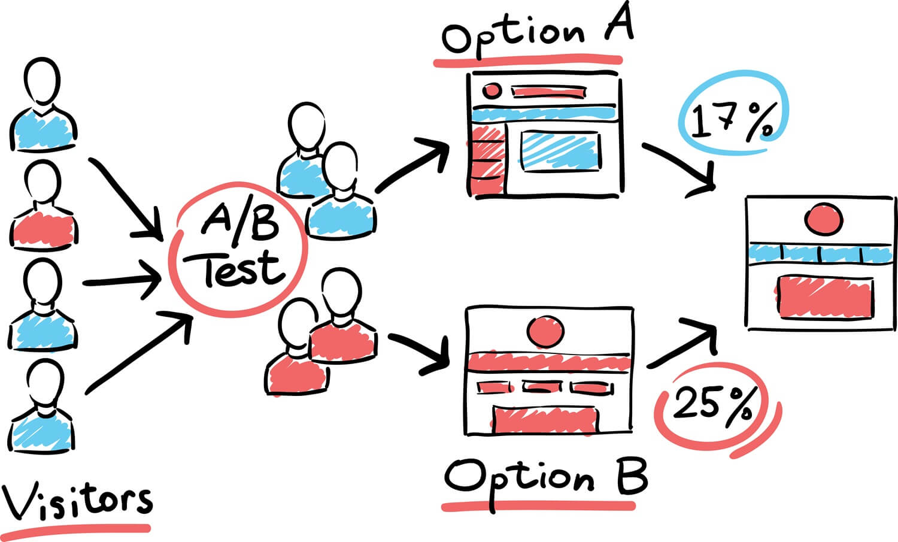

# Case Study for Hypothesis Test
This Hypothesis Test Case Study is non-obligatory part of the Data Scientist Nanodegree Program.

### Table of Contents
1. [Project Motivation](#motivation)
2. [File Description](#files)
3. [Installation / Setup](#installation)
4. [Impressions of the web app](#screenshots)
5. [Licensing, Authors](#licensing)

## Project Motivation 

The present case study is a part of the Nano-degree program of Udacity. 
Within this case study, the goal is to revise the structure of a homepage of a company in order to increase the number of people that download the software of this mentioned company as well as ultimately increase the number of licences purchased. 
 
The company's Website has five main sections: 
1. the homepage; 
2. a section with additional information. gallery, and examples; 
3. a page for users to download the software; 
4. a page for users to purchase a license; and 
5. a support subsite with documentation and FAQs software; 

For the software itself, the Website requires that users create an account in order to download the software program. The program is usable freely for seven days after download.
When the trial period is hit, the program will bring up dialog box that takes the 
user to the license page. After purchasing a license, the user will receive a unique Code associated with their Site account. This Code can then be used with the program to register it with that user, and the program can be used thereafter without issue. 

The goal is to leverage A/B Testing to check if the download rate and the licence purchase could be raised through revising the structure of the homepage.

Concretly we:
* Explore the data
* Execute A/B Testing on the data to check if the homepage structure has a significant influence on the above mentioned mesasures

## File Description 
**img/**: images for the readme & Notebook 
**/case_study_Exercise.ipynb**: Main notebook for the case study 
**/homepage-experiment-data.csv**: data provided by Udacity for the case study

## Licensing, Authors 
The credit for the data goes to Udacity.