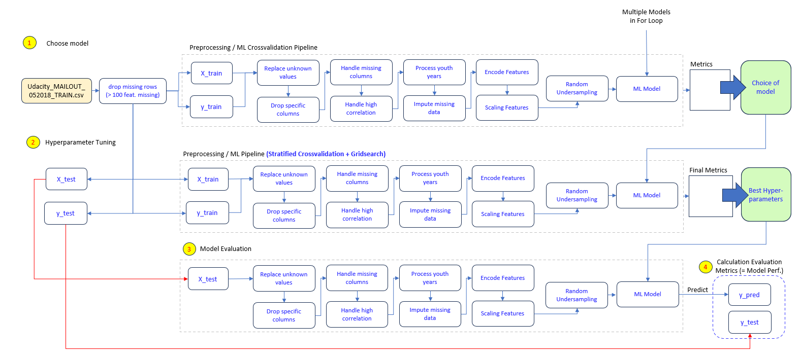

# Capstone Project Arvato-Bertelsmann Customer Segmentation
This Project is part of the Data Scientist Nanodegree Program.

### Table of Contents
1. [Project Motivation](#motivation)
2. [File Description](#files)
3. [Libraries used](#Libraries_used)
3. [Project Summary](#project_summary)
5. [Licensing, Authors](#licensing)

## Project Motivation 

The Arvato-Group is one of total 8 business units in the Bertelsmann Group which is a worldwide operating service company head-quarted in Germany. 
The main operating field of Avarto are logistics- and supply chain services and solutions, financial services as well as the operation of IT Systems. Concerning the general figures to get a grasp of the company, the company employs a staff around 77.342 persons (2020) and generates a sales volume of 5.56 Mrd. EUR per a (2024).

The present project can be localized in the financial services branch of Arvato (Arvato Financial Solutions) and is part of the Udacity Data Scientist Nanodegree Program.  
**One client of Arvato Financial Solutions, a Mail-Order Company selling organic products, wants to be advised concerning a more efficient way to acquire new clients. 
In essence, the company wants their acquisition marketing campaings instead of reaching out to everyone (costly), target more precisely those persons which show the highest probability to turn into new customers.**
  
The project spans two main tasks:
1) Customer Segmentation: An Analysis of the existing customer database dataset is carried out and on this basis a general recommandation of which people in Germany are most likely to be new customers of the company is generated.   
2) Modelling Campaign-Responses: Using the results of 1) to build a machine learning model that predicts whether or not an individual will respond to the respective campaign.

## File Description 
**data/img**: images for the readme & Notebooks 
**data/customer_segmentation/Udacity_AZDIAS_052018.csv**: Demographic dataset of Germany provided for the customer segmentation task 
**data/customer_segmentation/Udacity_CUSTOMERS_052018.csv**: Dataset (nearly the same structure as Azdias dataset) containing customer data of the client provided for the customer segmentation task 
**data/description/DIAS Attributes - Values 2017.xlsx**: Descriptive dataset provided for the customer segmentation task 
**data/description/DIAS Information Levels - Attributes 2017.xlsx**: Descriptive dataset provided for the customer segmentation task 
**data/modeling/Udacity_MAILOUT_052018_TEST.csv**: Test dataset provided for the supervised learning task 
**data/modeling/Udacity_MAILOUT_052018_TRAIN.csv**: Train dataset provided for the supervised learning task 
**data/concept.xlsx**: Excel notes for general concept to showcase the solution path for the tasks 

## Libraries used 
The following libraries were used:
* numpy
* pandas 
* os
* re
* matplotlib
* seaborn
* scipy
* sklearn
* xgboost
* imblearn
* warnings

## Project Summary
The project was made up of two parts:

**Unsupervised Learning:**

The general goal of this section is to find relevant customer cluster for the client, a mail-order company.  
The chosen instrument to achieve this clustering is the K-Means Clustering algorithm. In order to avoid the curse of dimensionality a PCA is performed before the clustering step to reduce the number of features (around 350). The goal was to keep 80% of the information and the number of features could be reduced from 350 to 127 features (incl. preprocessing steps). 
The K-Means algorithm has been performed on this reduced dataset in a range from k=3 to k=29 cluster-centroids and the optimal "k" has been chosen by using the elbow-method. 
The steps have been documented and the relevant topics explained along the analysis.

**Supervised Learning:**

In the supervised learning part a standardized preprocessing pipeline has been established and four different models (logistic regression, RandomForest, Adaboost, XGBoost) as well as a naive classifier have been tested for the experimentation.  
Due to the fact that the dataset shows a quite strong imbalance concerning the target variable, the "ROC_AUC" metric has been chosen for evaluation. 

The procedure for the supervised learning can be resumed as follows:

First step: Choose a model / models
  All 4 (or 5) models have been trained and crossvalidated within the pipeline and the XGBoost (0.72) and the RandomForest (0.71) performed best. So they were chosen for the second phase, the hyper parameter tuning.

Second step: Hyperparameter Tuning
  Within the course a test set is provided which can be used to test the final model and submit the result to kaggle. Due to the fact that a kaggle submission isn't possible anymore and in the forums of udacity a evaluation on the train set is recommanded we evaluate the performance on the train set.

  Hence, first of all a test set has been separated from the train data set to provide unseen data for later evaluation phase. Then for both models the best hyperparameters are determined via GridSearch. 

Third step: Model Evaluation
  With the determined Hyperparameter the models are trained on the whole training set of step 2 and the test set we separated in step 2 serves as evaluation data.

The XGBoost outperformed the RandomForest model (Roc_Auc Score: 0.79 vs 0.75) and has been chosen.

**Metrics** 

For the unsupervised part of the project, an optimal "k" for the K-Means clustering model had to be found. The elbow method was used to determine this optimal k. 
For the supervised part of the project, the performance of the respective models had to be evaluated / compared. Due to the fact that the dataset shows a severe target class imbalance, some metrics such as accuracy would have been an adequate metric for performance evaluation. The ROC_AUC Score takes Recall and the False Positive Rate over several thresholds into account and is therefore a good metric to evaluate a model's ability to distinguish between classes. In addition to that, precision was another metric which has been discussed due to its ability to evaluate the model's performance from another angle.

**Results**

**Unsupervised Learning**

The unsupervised learning part aimed to identify valuable cluster of individuals for the company. 
There were three significantly overrepresented clusters: Cluster 5, 7 and 8. 
* the cluster 5 seems to embody individuals of advanced age (~ 70 years old), living rather alone near the next city center (10-20 km) without children, earning a low income with the financial focus to own a house. Moreover the person in this cluster are not religous, not very close to the family, average critical minded, not really cultural minded, with a low affinity to material and low rational minded. 

* the cluster 7 seems to embody individuals of high age (1935-1939 birth), living rather with another person in a household farer away from the next city center (40-50 km), earning a high to average income with the financial focus to be preprared for the future. Concerning the general attitude of these individuals: They are highly religious, high to average close to the family, average critical minded, high to average cultural minded, highly material minded and highly rational minded.

* the cluster 8 seems to embody individuals of mid age (~55), living with 2-3 persons in a more rural area (around 30-50 km from the next city center) with 0-1 children, earning an average income with the financial focus to own a house. The persons in this cluster are rather not religious and neither family-near. They are average critical minded, with a low affinity to cultural topics, an average affinity to materialism and average rational.

**Supervised Learning**

In the first part of the section, the four models have been tested concerning their performance on the task at hand:

<table>
  <tr>
    <th>Model</th>
    <th>CV Mean Roc-Auc</th>
  </tr>
  <tr>
    <td>Naive Classifier</td>
    <td>0.51</td>
  </tr>
  <tr>
    <td>RandomForest Classifier</td>
    <td>0.71</td>
  </tr>
  <tr>
    <td>Logistic Regression</td>
    <td>0.6</td>
  </tr>
  <tr>
    <td>AdaBoostClassifier</td>
    <td>0.68</td>
  </tr>
  <tr>
    <td>XGBoostClassifier</td>
    <td>0.72</td>
  </tr>
</table>

Following these scores, XGBoostClassifier and RandomForestClassifier were chosen due for hyperparameter tuning: 

Model 1: Best parameters XGB 
{'model__colsample_bytree': 0.8,
 'model__learning_rate': 0.01,
 'model__max_depth': 5,
 'model__n_estimators': 200,
 'model__objective': 'binary:logistic',
 'model__subsample': 0.6,
 'model__tree_method': 'gpu_hist'}

 Model 2: Best Parameters RandomForest
 {'model__max_depth': 10,
 'model__max_features': 'sqrt',
 'model__min_samples_leaf': 2,
 'model__n_estimators': 100}

The following averaged CV Scores have been reached:
<table>
  <tr>
    <th>Metric </th>
    <th>XGBClassifier</th>
    <th>RandomForest</th>
  </tr>
  <tr>
    <td>AucScore</td>
    <td>0.79</td>
    <td>0.75</td>
  </tr>
  <tr>
    <td>Recall</td>
    <td>0.76</td>
    <td>0.71</td>
  </tr>
  <tr>
    <td>Precision</td>
    <td>0.03</td>
    <td>0.03</td>
  </tr>
</table>

**An article for a technical audience can be found following this blog post link [here](https://medium.com/@rb.wesselmann/the-great-art-of-learning-is-to-understand-customer-segmentation-udacity-capstone-project-2619c204d708)**

## Licensing, Authors 
The credit for the data goes to Udacity & Arvato Financial Solutions.